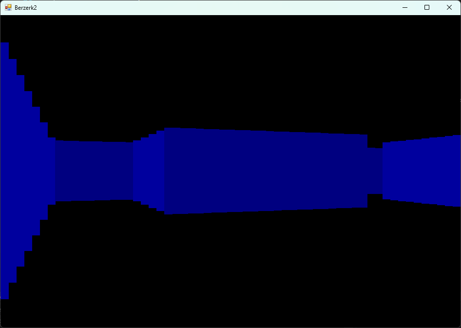

# Berzerk 3D
## About
Berzerk 3D is a work-in-progress attempt to recreate the classic 1980 video game [Berzerk](https://en.wikipedia.org/wiki/Berzerk_(video_game)) as a first person shooter. By using the raycasting approach to 3D (used in games such as Wolfenstien 3D), I was able to create a 3D level renderer in Windows Forms. This project is yet to be completed to my liking and I will continue to add features that are present in the original game in the future.
## Images
   
## Features
- [x] Raycaster with editable level via int array
- [x] Collision Detection
- [ ] Strafing left and right
- [ ] Enemy Sprites
- [ ] FPS Mechanics
- [ ] Title Screen
- [ ] HUD
- [x] Click the \` key to open the 2D view
